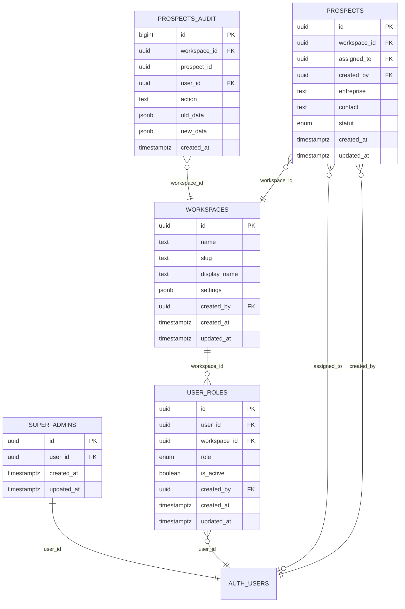

# Design Document - Système de Permissions par Rôle

## Overview

Ce document définit l'architecture technique pour implémenter un système de permissions granulaires avec 4 niveaux de rôles (Super Admin, Admin Workspace, Manager, Agent) et isolation complète des données par workspace.

## Architecture

### Modèle de Données



### Hiérarchie des Rôles

```typescript
enum UserRole {
  SUPER_ADMIN = 'super_admin',  // Gestion plateforme
  ADMIN = 'admin',              // Propriétaire workspace
  MANAGER = 'manager',          // Superviseur équipe
  AGENT = 'agent'               // Utilisateur final
}

interface PermissionMatrix {
  [UserRole.SUPER_ADMIN]: {
    workspaces: ['create', 'read', 'update', 'delete'],
    users: ['create', 'read', 'update', 'delete'],
    prospects: ['create', 'read', 'update', 'delete'],
    settings: ['read', 'update']
  },
  [UserRole.ADMIN]: {
    workspace: ['read', 'update'], // Son workspace uniquement
    users: ['create', 'read', 'update', 'delete'], // Dans son workspace
    prospects: ['create', 'read', 'update', 'delete'], // Dans son workspace
    settings: ['read', 'update'] // De son workspace
  },
  [UserRole.MANAGER]: {
    prospects: ['create', 'read', 'update_own', 'delete_own'],
    users: ['read'], // Lecture seule
    assignments: ['create', 'update'] // Assigner des prospects
  },
  [UserRole.AGENT]: {
    prospects: ['create', 'read_assigned', 'update_assigned', 'delete_own'],
    profile: ['read', 'update']
  }
}
```

## Components and Interfaces

### 1. Permission Service

```typescript
// src/lib/permissionService.ts
class PermissionService {
  // Vérifier si l'utilisateur peut effectuer une action
  async canPerform(
    action: string, 
    resource: string, 
    resourceId?: string
  ): Promise<boolean>
  
  // Obtenir les permissions de l'utilisateur
  getUserPermissions(userRole: UserRole, workspaceId: string): Permission[]
  
  // Filtrer les données selon les permissions
  filterDataByPermissions<T>(data: T[], userRole: UserRole): T[]
  
  // Vérifier l'accès à un workspace
  canAccessWorkspace(userId: string, workspaceId: string): Promise<boolean>
}
```

### 2. Enhanced Auth Context

```typescript
// src/contexts/AuthContext.tsx
interface AuthContextType {
  user: User | null
  userRole: UserRole | null
  workspace: Workspace | null
  permissions: Permission[]
  isSuperAdmin: boolean
  
  // Actions
  switchWorkspace: (workspaceId: string) => Promise<void>
  checkPermission: (action: string, resource: string) => boolean
  
  // État
  loading: boolean
  error: string | null
}
```

### 3. Protected Components

```typescript
// src/components/PermissionGate.tsx
interface PermissionGateProps {
  action: string
  resource: string
  resourceId?: string
  fallback?: React.ReactNode
  children: React.ReactNode
}

// src/components/RoleBasedRoute.tsx
interface RoleBasedRouteProps {
  allowedRoles: UserRole[]
  requiredPermissions?: string[]
  children: React.ReactNode
}
```

### 4. Enhanced Prospect Service

```typescript
// src/lib/prospectService.ts
class ProspectService {
  // Récupérer les prospects selon les permissions
  async getProspects(filters?: ProspectFilters): Promise<Prospect[]>
  
  // Créer un prospect avec vérification des permissions
  async createProspect(data: ProspectData): Promise<Prospect>
  
  // Mettre à jour avec vérification de propriété
  async updateProspect(id: string, data: Partial<ProspectData>): Promise<Prospect>
  
  // Supprimer avec vérification stricte
  async deleteProspect(id: string): Promise<void>
  
  // Assigner un prospect (managers/admins uniquement)
  async assignProspect(prospectId: string, userId: string): Promise<void>
}
```

## Data Models

### Base de Données - Nouvelles Tables

```sql
-- Table des super admins
CREATE TABLE super_admins (
    id UUID PRIMARY KEY DEFAULT uuid_generate_v4(),
    user_id UUID REFERENCES auth.users(id) ON DELETE CASCADE UNIQUE,
    created_at TIMESTAMPTZ DEFAULT NOW(),
    updated_at TIMESTAMPTZ DEFAULT NOW()
);

-- Mise à jour de la table workspaces
ALTER TABLE workspaces ADD COLUMN display_name TEXT;
ALTER TABLE workspaces ADD COLUMN created_by UUID REFERENCES auth.users(id);

-- Mise à jour de la table prospects
ALTER TABLE prospects ADD COLUMN created_by UUID REFERENCES auth.users(id);

-- Index pour les performances
CREATE INDEX idx_super_admins_user_id ON super_admins(user_id);
CREATE INDEX idx_prospects_created_by ON prospects(created_by);
CREATE INDEX idx_prospects_assigned_to ON prospects(assigned_to);
```

### Politiques RLS Avancées

```sql
-- Politique pour les super admins (accès global)
CREATE POLICY "super_admins_full_access" ON prospects
    FOR ALL USING (
        EXISTS (
            SELECT 1 FROM super_admins sa 
            WHERE sa.user_id = auth.uid()
        )
    );

-- Politique pour les admins (leur workspace uniquement)
CREATE POLICY "admins_workspace_access" ON prospects
    FOR ALL USING (
        workspace_id IN (
            SELECT ur.workspace_id 
            FROM user_roles ur 
            WHERE ur.user_id = auth.uid() 
            AND ur.role = 'admin' 
            AND ur.is_active = true
        )
    );

-- Politique pour les managers (leurs prospects + assignés)
CREATE POLICY "managers_own_and_assigned" ON prospects
    FOR SELECT USING (
        workspace_id = get_user_workspace_id() AND
        (created_by = auth.uid() OR assigned_to = auth.uid())
    );

-- Politique pour les agents (leurs prospects uniquement)
CREATE POLICY "agents_assigned_only" ON prospects
    FOR SELECT USING (
        workspace_id = get_user_workspace_id() AND
        (created_by = auth.uid() OR assigned_to = auth.uid()) AND
        EXISTS (
            SELECT 1 FROM user_roles ur 
            WHERE ur.user_id = auth.uid() 
            AND ur.role = 'agent'
        )
    );
```

## Error Handling

### Messages d'Erreur Spécifiques

```typescript
enum PermissionError {
  INSUFFICIENT_PERMISSIONS = 'Permissions insuffisantes pour cette action',
  WORKSPACE_ACCESS_DENIED = 'Accès refusé à ce workspace',
  RESOURCE_NOT_OWNED = 'Vous ne pouvez modifier que vos propres ressources',
  CANNOT_DELETE_ASSIGNED = 'Vous ne pouvez supprimer que vos propres prospects',
  ROLE_REQUIRED = 'Cette action nécessite un rôle spécifique'
}

class PermissionException extends Error {
  constructor(
    public code: PermissionError,
    public requiredRole?: UserRole,
    public requiredPermission?: string
  ) {
    super(code)
  }
}
```

### Gestion des Erreurs UI

```typescript
// src/hooks/usePermissionError.ts
export function usePermissionError() {
  const handlePermissionError = (error: PermissionException) => {
    switch (error.code) {
      case PermissionError.INSUFFICIENT_PERMISSIONS:
        toast.error('Vous n\'avez pas les permissions nécessaires')
        break
      case PermissionError.CANNOT_DELETE_ASSIGNED:
        toast.error('Vous ne pouvez supprimer que vos propres prospects')
        break
      // ... autres cas
    }
  }
  
  return { handlePermissionError }
}
```

## Testing Strategy

### Tests Unitaires

```typescript
// Tests des permissions
describe('PermissionService', () => {
  test('Super admin can access all workspaces', async () => {
    const canAccess = await permissionService.canAccessWorkspace(superAdminId, anyWorkspaceId)
    expect(canAccess).toBe(true)
  })
  
  test('Agent can only see assigned prospects', async () => {
    const prospects = await prospectService.getProspects()
    expect(prospects.every(p => p.assigned_to === agentId || p.created_by === agentId)).toBe(true)
  })
})
```

### Tests d'Intégration

```typescript
// Tests des politiques RLS
describe('Database Policies', () => {
  test('Manager cannot access other workspace prospects', async () => {
    await expect(
      supabase.from('prospects').select('*').eq('workspace_id', otherWorkspaceId)
    ).rejects.toThrow()
  })
})
```

### Tests E2E

```typescript
// Tests de l'interface utilisateur
describe('Permission UI', () => {
  test('Agent does not see delete button for assigned prospects', () => {
    // Test que les boutons de suppression ne sont pas visibles
    // pour les prospects assignés par un manager
  })
})
```

## Performance Considerations

### Optimisations Base de Données

1. **Index composites** pour les requêtes fréquentes
2. **Mise en cache** des permissions utilisateur
3. **Requêtes optimisées** avec filtres au niveau SQL
4. **Pagination** pour les grandes listes de prospects

### Optimisations Frontend

1. **Lazy loading** des composants selon les permissions
2. **Memoization** des vérifications de permissions
3. **Prefetch** des données autorisées
4. **State management** optimisé pour les permissions

## Security Considerations

### Défense en Profondeur

1. **Validation côté client** (UX)
2. **Validation côté serveur** (API)
3. **Politiques RLS** (Base de données)
4. **Audit complet** (Traçabilité)

### Principes de Sécurité

- **Principe du moindre privilège** : Accès minimal nécessaire
- **Séparation des responsabilités** : Rôles bien définis
- **Validation systématique** : Vérification à chaque niveau
- **Audit complet** : Traçabilité de toutes les actions