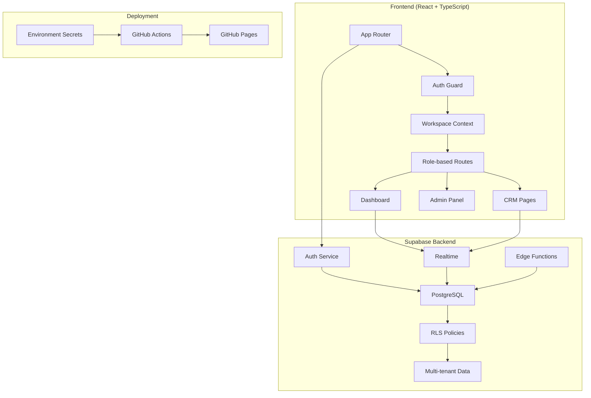
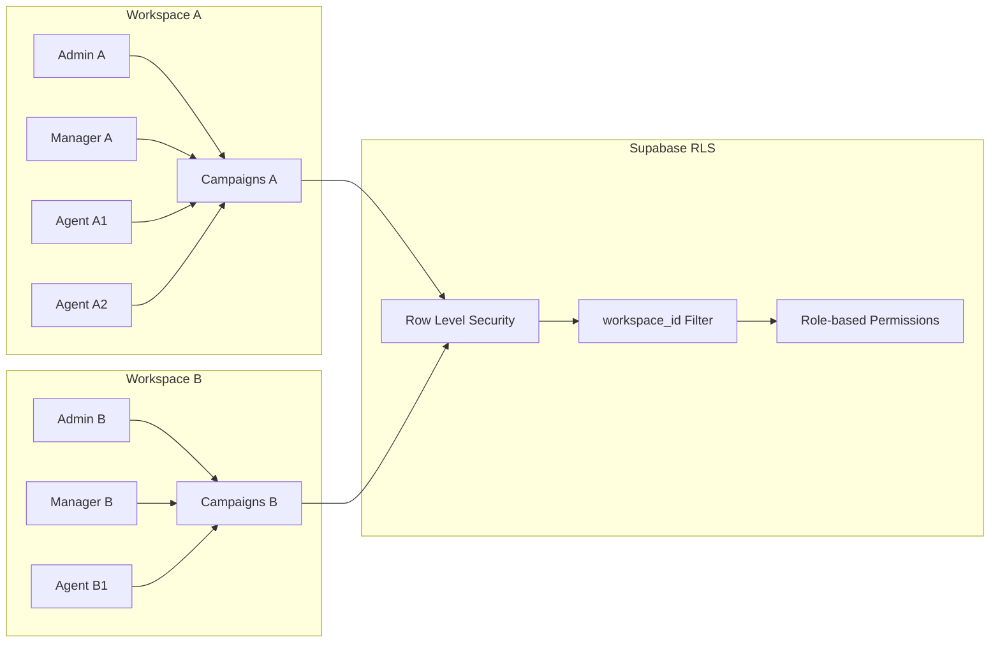

# Design Document - Ash CRM SaaS Multi-Tenant

## Overview

Ce document définit l'architecture technique pour transformer Ash CRM en une solution SaaS multi-tenant moderne. Le système utilisera React + TypeScript + Supabase avec une architecture modulaire, sécurisée et évolutive. L'interface utilisera une palette Or/Noir/Bleu/Blanc avec des composants shadcn/ui pour une expérience moderne et professionnelle.

## Architecture

### Architecture Globale



### Architecture Multi-Tenant



## Components and Interfaces

### 1. Authentication & Context System

#### AuthProvider Component
```typescript
interface AuthContextType {
  user: User | null;
  workspace: Workspace | null;
  userRole: UserRole | null;
  signIn: (email: string, password: string) => Promise<void>;
  signOut: () => Promise<void>;
  loading: boolean;
}

interface Workspace {
  id: string;
  name: string;
  slug: string;
  settings: WorkspaceSettings;
}

interface UserRole {
  role: 'admin' | 'manager' | 'agent';
  permissions: Permission[];
  workspace_id: string;
}
```

#### WorkspaceProvider Component
```typescript
interface WorkspaceContextType {
  currentWorkspace: Workspace;
  switchWorkspace: (workspaceId: string) => Promise<void>;
  updateWorkspaceSettings: (settings: Partial<WorkspaceSettings>) => Promise<void>;
  customFields: CustomField[];
}

interface CustomField {
  id: string;
  name: string;
  type: 'text' | 'number' | 'date' | 'select' | 'boolean';
  options?: string[];
  required: boolean;
  order: number;
}
```

### 2. Core Business Components

#### Campaign Management
```typescript
interface Campaign {
  id: string;
  workspace_id: string;
  name: string;
  description?: string;
  objective?: string;
  start_date?: Date;
  end_date?: Date;
  created_by: string;
  is_active: boolean;
  settings: CampaignSettings;
  stats?: CampaignStats;
}

interface CampaignStats {
  total_leads: number;
  conversion_rate: number;
  leads_by_status: Record<LeadStatus, number>;
}
```

#### Lead Management
```typescript
interface Lead {
  id: string;
  workspace_id: string;
  campaign_id?: string;
  assigned_to: string;
  
  // Standard fields
  entreprise: string;
  contact?: string;
  poste?: string;
  email?: string;
  telephone?: string;
  status: LeadStatus;
  source?: string;
  
  // Tracking
  derniere_action?: Date;
  prochaine_action?: Date;
  resultat?: string;
  notes?: string;
  
  // Dynamic fields
  custom_fields: Record<string, any>;
  
  // Metadata
  created_by: string;
  created_at: Date;
  updated_at: Date;
}

type LeadStatus = 'nouveau' | 'contacte' | 'relance' | 'rdv' | 'perdu' | 'gagne' | 'qualifie' | 'non_qualifie';
```

### 3. UI Components Architecture

#### Layout Components
```typescript
// Main application layout with sidebar navigation
interface AppLayoutProps {
  children: React.ReactNode;
  sidebar?: React.ReactNode;
  header?: React.ReactNode;
}

// Dashboard layout with filters and KPI cards
interface DashboardLayoutProps {
  filters: FilterComponent;
  kpis: KPICard[];
  charts: ChartComponent[];
  children: React.ReactNode;
}
```

#### Data Display Components
```typescript
// Modern data table with sorting, filtering, pagination
interface DataTableProps<T> {
  data: T[];
  columns: ColumnDef<T>[];
  filters?: FilterConfig[];
  pagination?: PaginationConfig;
  onRowClick?: (row: T) => void;
  customFields?: CustomField[];
}

// KPI card with modern design
interface KPICardProps {
  title: string;
  value: number | string;
  change?: number;
  trend?: 'up' | 'down' | 'stable';
  color: 'gold' | 'blue' | 'black' | 'white';
  icon?: React.ReactNode;
}
```

#### Form Components
```typescript
// Dynamic form builder for leads with custom fields
interface DynamicFormProps {
  schema: FormSchema;
  customFields: CustomField[];
  onSubmit: (data: any) => Promise<void>;
  initialData?: any;
}

// Modal for lead creation/editing
interface LeadModalProps {
  lead?: Lead;
  campaign?: Campaign;
  isOpen: boolean;
  onClose: () => void;
  onSave: (lead: Partial<Lead>) => Promise<void>;
}
```

### 4. Service Layer Architecture

#### Supabase Service
```typescript
class SupabaseService {
  private client: SupabaseClient;
  
  // Auth methods
  async signIn(email: string, password: string): Promise<AuthResponse>;
  async signOut(): Promise<void>;
  async getCurrentUser(): Promise<User | null>;
  
  // Workspace methods
  async getUserWorkspace(): Promise<Workspace | null>;
  async createWorkspace(data: CreateWorkspaceData): Promise<Workspace>;
  
  // Lead methods
  async getLeads(filters?: LeadFilters): Promise<Lead[]>;
  async createLead(lead: CreateLeadData): Promise<Lead>;
  async updateLead(id: string, updates: Partial<Lead>): Promise<Lead>;
  async deleteLead(id: string): Promise<void>;
  
  // Campaign methods
  async getCampaigns(): Promise<Campaign[]>;
  async createCampaign(campaign: CreateCampaignData): Promise<Campaign>;
  
  // User management
  async inviteUser(invitation: UserInvitation): Promise<string>;
  async getWorkspaceUsers(): Promise<WorkspaceUser[]>;
}
```

#### Export Service
```typescript
class ExportService {
  async exportLeads(
    leads: Lead[], 
    format: 'csv' | 'excel',
    customFields: CustomField[]
  ): Promise<Blob>;
  
  async exportCampaignReport(
    campaign: Campaign,
    format: 'csv' | 'excel'
  ): Promise<Blob>;
}
```

## Data Models

### Database Schema Enhancement

```sql
-- Core tables with relationships
workspaces (id, name, slug, settings, created_at, updated_at)
user_roles (id, user_id, workspace_id, role, invited_by, is_active)
campaigns (id, workspace_id, name, description, settings, created_by)
leads (id, workspace_id, campaign_id, assigned_to, custom_fields, ...)
leads_audit (id, workspace_id, lead_id, user_id, action, payload)
user_invitations (id, workspace_id, email, role, invitation_token, expires_at)

-- Views for analytics
v_campaign_kpis (campaign_id, total_leads, conversion_rate, ...)
v_agent_performance (user_id, workspace_id, total_leads, leads_gagnes, ...)
v_workspace_stats (workspace_id, total_users, total_campaigns, total_leads, ...)
```

### State Management

#### React Query Configuration
```typescript
// Query keys factory
export const queryKeys = {
  leads: {
    all: ['leads'] as const,
    lists: () => [...queryKeys.leads.all, 'list'] as const,
    list: (filters: LeadFilters) => [...queryKeys.leads.lists(), filters] as const,
    details: () => [...queryKeys.leads.all, 'detail'] as const,
    detail: (id: string) => [...queryKeys.leads.details(), id] as const,
  },
  campaigns: {
    all: ['campaigns'] as const,
    lists: () => [...queryKeys.campaigns.all, 'list'] as const,
    detail: (id: string) => [...queryKeys.campaigns.all, 'detail', id] as const,
  },
  dashboard: {
    kpis: (campaignId?: string) => ['dashboard', 'kpis', campaignId] as const,
    charts: (filters: DashboardFilters) => ['dashboard', 'charts', filters] as const,
  },
};

// Custom hooks
export const useLeads = (filters?: LeadFilters) => {
  return useQuery({
    queryKey: queryKeys.leads.list(filters || {}),
    queryFn: () => supabaseService.getLeads(filters),
  });
};
```

#### Zustand Store for UI State
```typescript
interface AppStore {
  // UI state
  sidebarOpen: boolean;
  currentCampaign: string | null;
  filters: DashboardFilters;
  
  // Actions
  setSidebarOpen: (open: boolean) => void;
  setCurrentCampaign: (campaignId: string | null) => void;
  updateFilters: (filters: Partial<DashboardFilters>) => void;
  
  // Computed
  filteredLeads: Lead[];
  campaignStats: CampaignStats | null;
}
```

## Error Handling

### Error Boundary Strategy
```typescript
// Global error boundary for unhandled errors
class GlobalErrorBoundary extends React.Component {
  // Handle Supabase errors, network errors, etc.
}

// Feature-specific error boundaries
class DashboardErrorBoundary extends React.Component {
  // Handle dashboard-specific errors
}

// Error types
interface AppError {
  type: 'auth' | 'network' | 'validation' | 'permission' | 'unknown';
  message: string;
  details?: any;
  timestamp: Date;
}
```

### Toast Notification System
```typescript
interface ToastService {
  success: (message: string) => void;
  error: (message: string, error?: AppError) => void;
  warning: (message: string) => void;
  info: (message: string) => void;
}
```

## Testing Strategy

### Unit Testing
- **Components**: Test rendering, props, user interactions
- **Hooks**: Test custom hooks with React Testing Library
- **Services**: Test Supabase service methods with mocks
- **Utils**: Test utility functions and helpers

### Integration Testing
- **Auth Flow**: Test complete authentication process
- **CRUD Operations**: Test lead creation, update, deletion
- **Role Permissions**: Test RLS policies and permissions
- **Dashboard**: Test KPI calculations and filtering

### E2E Testing (Future)
- **User Journeys**: Complete workflows from login to export
- **Multi-tenant**: Test workspace isolation
- **Responsive**: Test on different screen sizes

## Performance Optimization

### Frontend Optimization
```typescript
// Code splitting by route
const Dashboard = lazy(() => import('./pages/Dashboard'));
const CRM = lazy(() => import('./pages/CRM'));
const AdminPanel = lazy(() => import('./pages/AdminPanel'));

// Memoization for expensive calculations
const MemoizedKPICard = memo(KPICard);
const MemoizedDataTable = memo(DataTable);

// Virtual scrolling for large datasets
const VirtualizedLeadList = ({ leads }: { leads: Lead[] }) => {
  // Implementation with react-window
};
```

### Backend Optimization
```sql
-- Database indexes for performance
CREATE INDEX CONCURRENTLY idx_leads_workspace_status ON leads(workspace_id, status);
CREATE INDEX CONCURRENTLY idx_leads_assigned_campaign ON leads(assigned_to, campaign_id);
CREATE INDEX CONCURRENTLY idx_audit_workspace_date ON leads_audit(workspace_id, created_at DESC);

-- Materialized views for complex analytics (future)
CREATE MATERIALIZED VIEW mv_daily_stats AS
SELECT 
  workspace_id,
  date_trunc('day', created_at) as date,
  count(*) as leads_created,
  count(*) FILTER (WHERE status = 'gagne') as leads_won
FROM leads
GROUP BY workspace_id, date_trunc('day', created_at);
```

## Security Implementation

### Frontend Security
```typescript
// Route protection based on roles
const ProtectedRoute = ({ 
  children, 
  requiredRole 
}: { 
  children: React.ReactNode;
  requiredRole?: UserRole['role'][];
}) => {
  const { userRole } = useAuth();
  
  if (requiredRole && !requiredRole.includes(userRole?.role)) {
    return <Navigate to="/unauthorized" />;
  }
  
  return <>{children}</>;
};

// Input sanitization
const sanitizeInput = (input: string): string => {
  return DOMPurify.sanitize(input);
};
```

### Environment Variables Security
```typescript
// Environment validation
const envSchema = z.object({
  VITE_SUPABASE_URL: z.string().url(),
  VITE_SUPABASE_ANON_KEY: z.string().min(1),
  VITE_APP_ENVIRONMENT: z.enum(['development', 'staging', 'production']),
});

export const env = envSchema.parse(import.meta.env);
```

## Deployment Strategy

### GitHub Actions Workflow
1. **Lint & Type Check**: ESLint + TypeScript validation
2. **Unit Tests**: Run Jest/Vitest tests
3. **Build**: Create production build with environment variables
4. **Deploy**: Deploy to GitHub Pages with custom domain support
5. **Notifications**: Slack/Discord notifications on success/failure

### Environment Management
- **Development**: Local .env file
- **Staging**: GitHub Secrets for staging branch
- **Production**: GitHub Secrets for main branch
- **Feature Branches**: Use development environment

## Design System & Theming

### Color Palette Implementation
```typescript
// Tailwind config extension
const colors = {
  primary: {
    gold: '#FFD700',
    'gold-dark': '#B8860B',
    'gold-light': '#FFEF94',
  },
  neutral: {
    black: '#000000',
    'black-light': '#1A1A1A',
    white: '#FFFFFF',
    'white-dark': '#F5F5F5',
  },
  accent: {
    blue: '#0066CC',
    'blue-dark': '#004499',
    'blue-light': '#3399FF',
  },
};

// Component variants
const buttonVariants = cva(
  "inline-flex items-center justify-center rounded-md text-sm font-medium transition-colors",
  {
    variants: {
      variant: {
        gold: "bg-primary-gold text-neutral-black hover:bg-primary-gold-dark",
        blue: "bg-accent-blue text-neutral-white hover:bg-accent-blue-dark",
        outline: "border border-neutral-black bg-transparent hover:bg-neutral-black hover:text-neutral-white",
      },
    },
  }
);
```

### Responsive Design
```typescript
// Breakpoint system
const breakpoints = {
  sm: '640px',
  md: '768px',
  lg: '1024px',
  xl: '1280px',
  '2xl': '1536px',
};

// Mobile-first approach
const ResponsiveDashboard = () => {
  return (
    <div className="grid grid-cols-1 md:grid-cols-2 lg:grid-cols-3 xl:grid-cols-4 gap-4">
      {/* KPI Cards */}
    </div>
  );
};
```

## Future Extensibility

### Plugin Architecture (Future)
```typescript
interface Plugin {
  id: string;
  name: string;
  version: string;
  hooks: PluginHooks;
  components?: PluginComponents;
}

interface PluginHooks {
  beforeLeadCreate?: (lead: Partial<Lead>) => Partial<Lead>;
  afterLeadUpdate?: (lead: Lead) => void;
  customDashboardWidget?: () => React.ComponentType;
}
```

### API Integration Framework
```typescript
interface Integration {
  id: string;
  name: string;
  type: 'email' | 'calendar' | 'social' | 'analytics';
  config: IntegrationConfig;
  sync: (data: any) => Promise<void>;
}

// Example: LinkedIn integration
class LinkedInIntegration implements Integration {
  async syncContacts(): Promise<Lead[]> {
    // Implementation
  }
}
```

Cette architecture design fournit une base solide et évolutive pour ton CRM SaaS, avec une séparation claire des responsabilités, une sécurité robuste et une expérience utilisateur moderne.